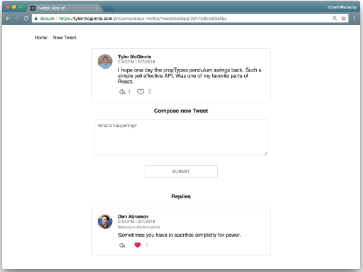
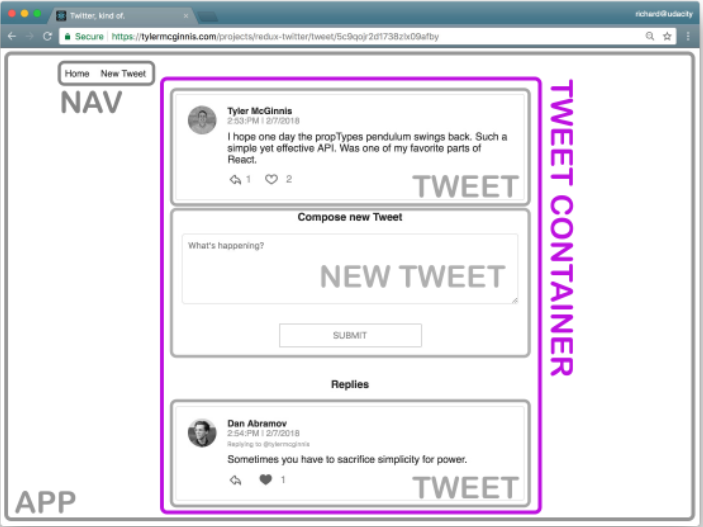

# Development Strategy for React-Redux App

# Read this before embarking on any Redux project!! [createStore deprecation(https://redux.js.org/introduction/why-rtk-is-redux-today#what-does-redux-toolkit-do)

We will complete an entire project together through these steps:


# 1. Project Planning

The key to all projects is to plan really thoroughly. You need to do this carefully, as you don't want to need to go back and restart a code all over.

**Jeejo** You want to sketch or build a Figma mock up and then focus at this stage on the **actions** that every single element will need to be able to perform. This can be written in psuedo-code, and it is kind of the **creative plan**. After you have done this, you can move on to the planning stage.

## Steps for Planning

1. Identify what each view should look like (hand sketch or Figma, or other [mock up software](https://codingsans.com/blog/mockup-tools))
2. Break each view into a hierarchy of components
3. Determine what events happen in the app
4. Determine what data lives in the store

## 1. STEP ONE: Identify what each View should look like

Our views for this app are:

1. Dashboard View
2. Tweet View
3. Create new Tweet View

**1. Dashboard View**


**Dashboard View Requirements**:

- Is located at the home (or, "root") route (/)
- Shows tweets sorted from most recently added at the top, to oldest at the bottom
- Each tweet will show:
  - The author
  - The time stamp
  - Who the author is replying to
  - The text of the tweet
  - A "reply" button - with the number of replies (if higher than 0)
  - A "like" button - with the number of likes (if higher than 0)

**2. Tweet View**



**Tweet View Requirements**:

- Is located at /tweet/:id
- Shows an individual tweet:
  - The author
  - The timestamp
  - A "reply" button - with the number of replies (if higher than 0)
  - A "like" button - with the number of likes (if higher than 0)
- Has a reply form
- Shows all replies

**3. Create New Tweet View**


**Create New Tweet View Requirements**:

- Is located at /new
- Has a textarea input for adding a new tweet (see [textarea input tag](https://www.w3schools.com/tags/tag_textarea.asp))])
  - Number of available characters
  - Submit button

## 2. STEP TWO: Break each view into a hierarchy of components

1. Draw boxes around each component, and then name them.
2. Arrange the components into a hierarchy.

How do we know if something should be a component? According to [React](https://reactjs.org/docs/thinking-in-react.html#step-1-break-the-ui-into-a-component-hierarchy) '...a component should ideally only do one thing. If it ends up growing, it should be decomposed into smaller subcomponents.'

Also remember that you can make a container/presentational divide between components: Use components to your advantage to isolate specific sections of the app, either as access data (containers) or focused on the UI (presentational).

**Components for the Dashboard View**


1. **App** - the overall container for the project
2. **Navigation** - displays the navigation
3. **Tweet List** - responsible for the entire list of tweets
4. **Tweet** - in charge of display the content for a single tweet

**Components for the Tweet View**


1. **App** - the overall container for the project
2. **Navigation** - displays the navigation
3. **Tweet Container** - displays a list of tweets
4. **Tweet** - displays the content for a single tweet
5. **New Tweet** - display the form to create a new tweet (reply)

**Components for the Create New Tweet View**


1. **App** - the overall container for the project
2. **Navigation** - displays the navigation
3. **New Tweet** - display the form to create a new tweet

### Total Components

We don't want to be duplicating components, so we can instead combine them all in to one single list of our required components:

Presentational Components:

- App
- Navigation
- Tweets List
- Tweet Container
- Tweet
- New Tweet

For now, all of our components can be classified as presentational components. As we start building out the store, we'll create additional components that will be container components to get data from the store and pass it to the presentational components that need the data.

## 3. STEP THREE: Determine what events happen in the app

We need to take a look at what is happening in each component. Let's determine what actions the app or the user is performing on the data. Is the data being set, modified, or deleted? Beyond that, we'll also need an action to keep track of any event that takes place!

Let's _italicize the action_ and **bold the data**.

**Tweets List Component**


Actions: _Get_ the **Tweets**
Possible Events: GET_LIST_OF_TWEETS or GET_DATA.

**Tweet Component**


Actions:
_Get_ a particular tweet from a list of **tweets**.
_Get_ the **authedUser** (user that is currently logged in) so the user can toggle the likes on each **tweet**.
_Get_ the **authedUser** so the user can reply to a **tweet**.

**Tweet Container Component**



Actions:
_Get_ a specific tweet from a list of **tweets**.
_Get_ the replies to a specific tweet from a list of **tweets**.

**New Tweet Component**


Actions:
_Get_ the **authedUser** so the user can _create_ a new **tweet**.
_Set_ the **text of the new tweet**.

## 4. STEP FOUR: Determine what data lives in the store

We use Redux to avoid propagation of props all the way through the components tree, and to ensure consistency and predictability of the state across the store.

We need to figure out whether to store a piece of data in the Store or within a particular component. According to Redux: "Use Redux for state that matters globally or is mutated in complex ways… The rule of thumb is: do whatever is less awkward."

By this we can think of two rules of thumb:

1. Is it used by multiple components? If yes, store it in the store.
2. Is it mutated in a complex way? If yes, store it in the store.

Otherwise, it can probably stay local to the particular component.

Our actions:

**Text of the new tweet** (_used by:_ New Tweet component) > LOCAL TO COMPONENT
**Tweets**, including **User** (_used by:_ Dashboard component, Tweet Page component, Tweet component) > THE STORE
**authedUser** (_used by:_ Tweet component, New Tweet component) > THE STORE

Most of our data is therefore going to be held in the store:

    - Tweets
    - User
    - authedUser

# 2. Begin Building Code - Setting our 'Framework'

# 1. STEP ONE: Actions

**NOTE** Refer to actual code files for comments

1. Create an actions folder within src/
2. Create the required actions files:
   1. shared.js
   2. tweets.js
   3. user.js
   4. authedUser.js
3. Start building the shared.js file:
   1. Import the API initial data (or use a temporary database file)
   2. Export default function that contains the asynchronous request for initial data (name it handleInitialData)
4. Start building the tweets.js and users.js files:
   1. Export the action-type variable (e.g. EXAMPLE_ACTION)
   2. Export a function that returns the action object (name it exampleAction)
5. Go back to shared.js:
   1. Import the above two action creators
   2. Create a new const called AUTHED_ID
   3. Add another dispatch but for the current practise app use a hardcoded AUTHER_ID value (e.g 'markrawlins')
6. Start building the authedUser.js file:
   1. **NOTE** Usually you would need to build out a process for authenticating a user, but this is just a mock-up
   2. Export the action-type variable (e.g. SET_AUTHED_USER)
   3. Export a function that returns the action object (name it setAuthedUser) that takes in the id of the Authed User (e.g. (id))

# 2. STEP TWO: Reducers

Reducers describe _how_ an application's state changes. The key is that it must return a new state object, rather than simply mutating the current state. It may be worth reading up on [spread operators](https://redux.js.org/usage/structuring-reducers/immutable-update-patterns).

The signature of a reducer is:

`(previousState, action) => newState`

    - **previousState** is the state before the action was dispatched
    - **action** is the action that was dispatched
    - **newState** is the state after the action was dispatched

We will need three reducers (tweets, users, authedUser) that will be responsible for acting as an intermediary between the Store and the UI. In short, the store will reflect the result of tweet _actions_ passing through tweet _reducers_, and so on.

1. Create a reducers folder within src/
2. Create the required reducer files:
   1. index.js (this will be for our combined reducer)
   2. tweets.js
   3. users.js
   4. authedUser.js
3. In the users.js file:
   1. Import the action-type variable (e.g. RECEIVE_USERS)
   2. Export default function named 'users', which takes in the state and the action as arguments
   3. Switch by action type cases
4. Repeat the same logic for the tweets.js file
5. In the authedUser.js file:
   1. Import the action type variable (e.g. SET_AUTHED_USER)
   2. Export default function named 'authedUser', taking in state and action, but this time state will initially be _null_ rather than an empty object
   3. Switch action by case, and just return the action.id
6. Open the index.js file:
   1. Import combineReducers from Redux
   2. Import the above three reducers that we just created
   3. Export the results of the combineReducers function having passed the three reducers as arguments

Now, all three reducers manage their own slice of the state, and the combineReducer acts as a kind of root reducer (as createStore only accepts one reducer!)

# 3. STEP THREE: Create the Store

The point of creating a store is to allow components to be able to access it without having to pass the data down through multiple components.

The Provider component (which comes from the react-redux package) makes it possible for all components to access the store via the connect() function.

`npm i react-redux redux`

1. Open the _main_ index.js file:
   1. Import createStore from Redux **NOTE**: warning to instead use configureStore from @reduxjs/toolkit
   2. Import Provider from React-Redux
   3. Import reducer from './reducers' (this is the shorthand for the index.js root reducer)
   4. Create a const store variable
   5. Wrap the app component inside the Provider component and pass store={store}
2. Check the app is still rendering whatever basic UI you started with without errors `npm start`

# 4. STEP THREE: Set up the App's Middleware Functions

`npm i redux-thunk`

Middleware always follows this curried function signature:

    const logger = (store) => (next) => (action) => {
        // ...
    }

The variable logger is assigned to a function that takes the store as its argument. That function returns another function, which is passed next (which is the next middleware in line or the dispatch function). That other function return another function which is passed an action. Once inside that third function, we have access to store, next, and action.

It’s important to note that the value of the next parameter will be determined by the applyMiddleware() function. Why? All middleware will be called in the order it is listed in that function.

Since our handleInitialData function is returning a function of dispatches, we need to make sure we set up Thunk middleware.

1. Create a middleware folder within src/
   1. index.js (just to export the invocation of applyMiddleware)
   2. logger.js (a custom middleware function for debugging purposes)
2. In the logger.js file:
   1. Using the currying pattern, create a logger function (see above pattern ^ )
   2. Use a console.group() and console.groupEnd() to group the console output
   3. We want to log when the action occurs: console.log("The action: ", action)
   4. Get the return value by invoking next that will be the dispatch function
   5. console.log the new state
   6. export default logger;
3. In the index.js file:
   1. Import the logger function
   2. Import thunk from redux-thunk
   3. Import applyMiddleware from redux
   4. Export the invocation of applyMiddleware passing in the logger and thunk functions
4. In the _main_ index.js file:
   1. Import middleware from "./middleware";
   2. Pass 'middleware' as the second argument in our createStore function

# 3. Writing the App

# 1. STEP ONE: Initializing the App's Data

Our handleInitialData is a key function as it combines the dispatches required for the action creators to work. Also, since our Dashboard view has the "/" route, it could theoretically hold the initialized data, BUT we would immediately run into trouble when viewing Tweets as both the Tweet View ("tweet/:id") and the New Tweet View ("new-tweet") woould be rendered empty.

It makes most sense, therefore, to place the store data in our App component, since all views render within the App component.

1. Open the App.js file inside of the components folder
2. Import useEffect (for fetching the intial data)
3. Import connect from react-redux
4. Import handleInitialData function
5. Alter export default so that it invokes the connect function and then renders the App component
6. Now that the App component has access to dispatch via props, we can pass the props in as its argument
7. Create uesEffect with the second argument as an empty array
8. Within the useEffect function, invoke the handleInitialData function: `props.dispatch(handleInitialData());`

Although our UI will not have changed, if you open up the console within the browser, you will now see the initialized data, thanks to our setting up the logger middleware.

# 2. STEP TWO: Start Building the Dashboard View

During planning, we determined that the Dashboard View would need to be a container function. This is because it will need access to the **tweets** data.

In order to build a container function, we need to use connect(). The signature looks like this:

    connect([mapStateToProps], [mapDispatchToProps], [mergeProps], [options])

The functions mapStateToProps and mapDispatchToProps are incredibly important, though technically optional. You can read about them in the [React Redux Documentation](https://react-redux.js.org/using-react-redux/connect-mapstate).

During planning, we said that the Tweet component will be inside the Dashboard component in our hierarchy. If the Dashboard component knows the ID of the tweet that needs to be displayed, it can just pass that ID to the Tweet component, which will render the tweet.

For our Dashboard component, the mapStateToProps function will need to 'care about' the **tweets** slice of state, and the resulting property that will show up in this container are the **tweetIds**.


1. Inside the components folder create a new file called Dashboard.js
   1. Import connect from react-redux
   2. Create a quick skeleton function to ensure some UI is rendered (takes in props, returns a div with the word 'Dashboard', for example). Console.log(props) for now.
   3. Create you mapStateToProps function (the data it needs is destructured props { tweets }, and it needs to return an object with the tweetIds property on it - as shown in the above picture ^ ), but add a sort to sort the tweets by time stamp
   4. Add: export default connect(mapStateToProps)(Dashboard);
2. Open the App.js file
   1. Import Dashboard
   2. Render the Dashboard component
3. Check the console in the browser and check that we now have access to some props, i.e. dispatch props and tweetIds. Also, the view should be rendering the Dashboard component.
4. In the Dashboard component we can begin rendering some UI:
   1. Rather than going for a full render, it is better to go slowly: we will start by just rendering the tweetIds
   2. Add a h3 within the return statement (you can remove the skeleton text 'Dashboard', but keep the divs)
      1. Give the h3 a className of 'center' and add a snappy title
      2. Add a ul with the className 'dashboard-list'
      3. Render the individual tweetIds within this list. This will mean JS object with props.tweetIds
      4. map over the tweetIds and call each item an (id)
      5. Render a list item within the maps callback, remember to use the id as the key
      6. Within each li item render a div with skeleton text, such as 'TWEET ID: {id}'
5. Check the browser is rendering you expected UI, if it works go back and remove the console.log(props)
6. In App.js and add a mapStateProps const:
   1. Pass in the authedUser as a destructered object prop/argument
   2. Return an object with a loading property that equals true if authedUser === null
   3. Then render within our returned div: {props.loading === true ? null : DASHBOARDCOMPONENT} - this ensures we don't render any UI until our initial data has been fetched

# 3. STEP THREE: Start Building the Tweet View

Out Tweet View component requires access to **tweets**, **users**, and **authedUser**.

The tweet component will be responsible for rendering each of the individual tweets.

1. Create a Tweet.js file in components/
   1. Import connect from react-redux
   2. Create a function called 'Tweet' and pass in props
   3. Place 'export default Tweet;' at the bottom of the file
   4. Inside the Tweet component, return a single div with the className "tweet"
   5. Below, create the const mapStateToProps and pass in the destructered props objects 'authedUser', 'users', and 'tweets'
   6. As the second argument for mapStateToProps, we want to pass in the destructered props object 'id'
   7. Store id in a variable, e.g. tweet
   8. Return the object authedUser
   9. Import formatTweet from '../utils/helpers' (the help takes in the tweet, authedUser, and users objects and returns a formatted tweet object with data about the tweet)
   10. Now is a good time to test that our props are correctly being passed through: export default connect(mapStateToProps)(Tweet);
   11. Temporarily console.log the props in the Tweet component so we can check it is working
2. Return to Dashboard.js and change the rendering div>TWEET ID: {id} /div> to our Tweet component
   1. Import the Tweet component
   2. Render the Tweet component and pass the id={id} as a prop
   3. Check the browser and view the console to see that we are getting all the require information within the tweet: authedUser, dispatch, the tweet itself, and the tweetId
3. Return to Tweet.js and work on passing information about parent tweet (so that we can use 'reply to tweet information')
   1. Within the mapStateToProps function, create a variable called 'parentTweet'. We have a value to the replyingTo property on the tweets object, and it is the id of the parent tweet: const parentTweet = tweets[ tweet.replyingTo ];
   2. Add parentTweet as the fourth argument to the formatTweet function within the mapStateToProps function
   3. We need to avoid an error if no parent tweet exists, so alter the parentTweet variable: const parentTweet = tweet ? tweets[ tweet.replyingTo ] : null;
   4. We want to do the same with the tweet in the return statement, i.e. tweet: tweet ? formatTweet(tweet, users[ tweet.author ], authedUser, parentTweet) : null,
   5. Remove console.log and replace it with logic that says if (tweet doesn't exist) return a message 'This tweet doesn't exist.'
4. Check the browser and see if the console reflects the new state with likes, replies, and crucially **replyingTo**

# 4. STEP FOUR: Build out the UI for the Individual Tweets

At this stage, you need to be sure that the Tweet component is returning all the data we need to render our timeline. But as yet, it doesn't render anything on the screen (maybe just a list of boxes), so we can now begin rendering the UI.

      npm i react-icons

Import some icons that we will use in the Tweet component:

      import { TiArrowBackOutline, TiHeartOutline, TiHeartFullOutline } from 'react-icons/ti';

1. Within the Tweet component:

   1. Destructure the properties we are going to need in a variable: { name, avatar, timestamp, text, hasLiked, likes, replies, parent } which all comes from props.tweet;
   2. Within the return statement, and within the tweet div, render the image for the avatar with the className="avatar"
   3. Check in the browser that the avatar is showing up correctly
   4. Create a new div under the avatar with the className="tweet-info"

      1. Inside this div, create a span and render the {name}
      2. Import format date from '../utils/helpers'
      3. Create a div under the name span with the function formatDate(timestamp)
      4. Enter a p tag that will render the tweet text, this will be placed _under_ point 5 below
      5. Next, we only want to render the parent information if there is actually a parent, returning a button with an onClick event that returns an invocation passing the parentTweet as a parameter:

   ```
   {
      //if the tweet has a parent, we want to render the parent tweet
         parent && (
            < button className="replying-to" onClick={(e) => toParent(e, parent.id)}>
               Replying to @{parent.author}
            < /button>
         )
   }
   ```

   We then need to build out a quick skeleton for the toParent function as it doesn't exist yet...

   ```
   const toParent = (e, id) => {
   e.preventDefault();

   //TODO: redirect to parent tweet

   };
   ```

Check the current state of the UI. It won't be perfect yet, of course, but it should be rendering all the things we would expect so far.

2. Render our reply and like buttons
   1. Under the text paragraph, create a new div with the className="tweet-icons"
   2. Within the tweet-icons div, render < TiArrowBackOutline className="tweet-icon" />
   3. Below that, create a span that shows replies if they are not zero: < span>{replies !== 0 && replies}</ span>
   4. Below that, create a button with the className="heart-button"
   5. Create another skeleton function (similar to toParent) for the heart-button and call in handleLike onClick
   6. Back within the heart-button div, if the tweet hasLiked is true, render < TiHeartFullOutline className="tweet-icon" />
      1. Else, render < TiHeartOutline className="tweet-icon" />
   7. Under the heart-button div, render < span>{likes !== 0 && likes}</ span> to show likes if there are any
   8. Check the browser and see if the data is being rendered correctly
      1. If the alignment is off, you can add a new div under the tweet-info div and move up everything from name to text to sit in the new div (but leave the tweet-icons div where they are)

Now we have been able to leverage all the information that comes with a tweet, and use it to build a respectable user interface.

# 5. STEP FIVE: Handle the Loading Lag

At present, if we refresh the page, there is a short loading lag. For UX purposes this needs to be handled.

      npm i react-redux-loading-bar

1. Open reducers/index.js
   1. Import { loadingBarReducer } from 'react-redux-loading-bar';
   2. Add loadingBar: loadingBarReducer to our combinedReducers object
2. Open actions/shared.js
   1. Import { showLoading, hideLoading } from 'react-redux-loading-bar';
   2. Invoke dispatch(showLoading()) before we return getInitialData
   3. Dispatch hideLoading after all of our other dispatches have been completed
3. Open App.js
   1. Import { LoadingBar } from 'react-redux-loading-bar';
   2. Render the loading bar component inside of a return statement after the first div tag

# 6. STEP SIX: Like Tweet Functionality

The Tweet component needs access to the authedUser to show whether or not the logged-in user has liked a tweet and so that they can send replies.

This requires an asynchronous action creator as not only the store, but _also the database_ need to reflect if the logged-in user has liked a tweet.

However, we don't want to wait for the backend response before rendering as this will be poor UX.

Instead, we will use **Optimistic Updating**.

1. Open **actions/tweets.js**
   1. Import the requisite function from our api, in this case { saveLikeToggle }
   2. Export a new const event called TOGGLE_TWEET
   3. Create a new action creator called toggleTweet
   4. It takes in an object containing an id, authedUser, and a state of whether the user has liked it or not
   5. Return an object with four propertie: type: TOGGLE_TWEET, plus the 3 properties we passed in
   6. Export a new function called handleToggleTweet
   7. Pass in info as an argument
   8. Return a function that takes in dispatch as an argument
   9. Dispatch our newly written toggleTweet function and pass in the info as an argument
   10. Return an invocation of saveLikeToggle(info)
   11. Catch any errors and dispatch an error action including a console.warn. Also send an alert to the user.
2. Open **reducers/tweets.js**
   1. Import TOGGLE_TWEET
   2. Add a case for TOGGLE_TWEET
   3. Return an object with all the previous tweets using a spread operator on the state
   4. Grab the particular toggle tweet action via it's id as an object property
   5. Add it to the spread state
   6. Remove/Add the user name from the hasLiked array based on whether the user has liked it or not in the toggle action
      1. Check if hasLiked is true, if so we want to go to the likes and ask if the current user is on the hasLiked array or not
      2. If yes, call filter and remove the current user name
      3. If no, concat the current user to the hasLiked array
3. Open **component/Tweet.js**
   1. Import our action creator handleToggleTweet
   2. Remove the earlier TODO comment from handleLike function
   3. const and grab our dispatch, tweet, and authedUser from props destructured from props
   4. dispatch handleToggleTweet action creator
   5. Pass in an object containing { id: tweet.id, authedUser, hasLiked: tweet.hasLiked }
4. Confirm the functionality of liking/unliking tweets is working in the browser (UI and console)

# 7. STEP SEVEN: Writing a Tweet

This time we will start by setting up a skeleton for the UI required, and then fill in the actions, reducers, etc. afterwards.

1. Create a new component called 'NewTweet.js'
   1. Create a skeleton UI with const NewTweet
   2. Return a new div with some text saying New Tweet
   3. Open App.js
      1. Import NewTweet from './NewTweet'
      2. TEMPORARILY render NewTweet instead of Dashboard
      3. Check it renders in the browser
2. Build a controlled component (meaning that React will be in control of the input fields)
   1. Open NewTweet.js
      1. Import useState
      2. Insert the useState hook into the NewTweet component (text, setText)
      3. Create a const handleChange event method
      4. Grab the e.target.value in a variable named 'text'
      5. Set the state as the entered text: setText(text)
      6. **NOTE** We are using the standard React useState here instead of Redux. This is because no other component need this state, and the state is not going to be passed down through multiple components, which are two of the main reasons for using Redux. It is simpler to use React's useState if we don't need either of those features.
      7. Create a const handleSubmit method
      8. Call event.preventDefault()
      9. Enter a temporary TODO comment 'add the tweet to the store'
      10. For debugging purposes, console.log the text
      11. Reset the setText state to an empty string
   2. Build out the UI within the return statement of NewTweet.js
      1. Remove the 'New Tweet' text we entered
      2. Within the div tags, add a h3 tag with the className center, and add some snappy title text
      3. Enter form tags below h3 with a className of 'new-tweet' and onClick invoke the handleSubmit function
      4. Add textarea tag and include a placeholder, and the value={text} and the onChange={handleChange} method, and a className 'text-area' **and** a maxLength={280}
   3. Tow improve UX, add a backwards counter to show user how many characters left remaining
      1. Create a new variable called 'TweetLeft' and assign it the value 280 - text.length
      2. Under the textarea tag, conditionally render a new div: {tweetLeft <= 100 && < div className="tweet-length">{tweetLeft}</ div>}
      3. Under this, enter a button tag with className="btn", type="submit"
         1. We also want to add a conditional styling, so that if the textarea is empty then we don't allow the button to be clicked: disabled={text === ""}
3. Open the browser and check the UI responds as expected and examine the console after submitting a new tweet to see if it shows up

Next, we want to add the functionality to the Tweet component (dispatching and updating the store). Once the tweet is submitted, we return to Redux territory, since we want our tweet to be saved to the database, and we also know that it will be used by more than one component.

Recording tweets in our database will be an asynchronous operation, so we know we will also need Redux Thunk.

1. Open up actions/tweets.js
   1. Add saveTweet to our imports from the api file
   2. Import showLoading and hideLoading from react-redux-loading-bar
   3. export const ADD_TWEET = 'ADD_TWEET'
   4. Build an action creator called addTweet that takes in a tweet
      1. Return an object with two properties: type: ADD_TWEET, and the tweet
   5. Build our asynchronous action creator: export function handleAddTweet
      1. Takes in the text of the tweet, as well as replyingTo (if any)
      2. Return a function and pass it (dispatch, getState) as arguments
      3. We can now grad the {authedUser} in a variable by invoking getState();
      4. Dispatch the showLoading action creator
      5. Return saveTweet, passing in an object that takes in the text and author: authedUser, as well as replyingTo
      6. Once it resolves, .then((tweet) => dispatch(addTweet(tweet)));
      7. .then dispatch hideLoading action creator
2. Open up reducers/tweets.js
   1. Import ADD_TWEET
   2. Create a new case for ADD_TWEET
   3. Grab the actual tweet: const { tweet } = action;
   4. Take the new tweet and add it as a property on our tweets array:
      1. Return an object
      2. Spread the previous tweets on to it with ...state
      3. Add the new tweet to our tweet state
      4. Go back up above the return statement and create a new object called let replyingTo with a value of an empty object
      5. Below the variable declaration, add conditions if tweet.replyingTo is not null, then return an object to replyingTo
      6. The replyingTo object will contain spread ...state[ tweet.replyingTo ]
      7. Modify the replies property of the specific slice of our state:
         1. replies: state[ tweet.replyingTo]
         2. Concat the tweet onto the array of replies - .replies.concat([ tweet.id]),
      8. Go back to return and spread our brand new state for replyingTo (...replyingTo)
3. Open up components/NewTweet.js
   1. Import connect
   2. Import handleAddTweet
   3. Alter export default to the connect pattern
   4. Scroll up to our handleSubmit method, and dispatch handleAddTweet(text, id), and we can remove the console.log
   5. For the props of NewTweet we will want to destructure {dispatch, id}
4. Return to console of browser and check that the event is working

When the user is writing a new tweet, they will be at the /new route and the tweet will be unattached, but when the user is responding to a tweet, they will be routed to the /tweet/:id route and the tweet will be attached to the tweet they are responding to.

# 8. STEP EIGHT: Build out the Tweet Page

1. Create a component called TweetPage.js
   1. Create a quick skeleton outline
   2. Return a render of a single div with 'Tweet Page' inside
   3. Export it
   4. Go to App.js and switch out 'NewTweet' rendering to 'TweetPage', import TweetPage
   5. Check it renders in the browser
   6. Pass the props into the TweetPage component rendering on App.js
      1. match={{ params: { id: *hardcode an id here* } }} e.g. "2mb6re13q842wu8n106bhk"
2. Open TweetPage.js component
   1. Import connect and update export to a connect export
   2. Create a mapStateToProps function and pass an object containing tweets, users, and autherUser PLUS after the object pass a second argument of props
   3. Grab the props.match.params and assign it to {id}
   4. Return the data that we want to be passed to the component
   5. Pass in the props to TweetPage function, and directly below console.log(props)
   6. Open the console and although the UI will not have changed, we can check that we are getting all the props we expect from console.log

# 9. STEP NINE: Build out the UI for Tweet Page

1. Open TweetPage.js
   1. Import Tweet and NewTweet components
   2. Remove the Tweet Page text and instead render the Tweet component passing in the id={props.id}
   3. Render the New Tweet component
   4. Below New Tweet add a JS {} and inside check that replies.length is not zero
   5. If not zero, render a h3 with the className of center and add a snappy title text
   6. Below that, create an ul within which we want to map over the props.replies, and map takes in a callback of replyId
      1. For each replyId being mapped over create a li item (with a key={replyId})
      2. Each li item will be the Tweet component itself with an id property of the replyId

# 4. Apply React Router

      npm i react-router-dom

- BrowserRouter: Listen to the URL and makes sure the correct screen shows up
- Link: Allows for Link to navigation

1. Add a Nav.js in your components folder
   1. Import Link
   2. Create a component function called Nav
   3. Return a nav tag with className="navbar"
   4. Create a ul
   5. Place two li components inside with a < Link to="/" and < Link to="/new" respectively, give them quirky titles
   6. Export default Nav;
2. Open App.js
   1. Import Nav
   2. Import Routes, Route
   3. Add Fragment to import list from React
   4. Copy and delete the rendering from within the return statement
   5. Enter Fragment tags to wrap everything
3. Open the _main_ index.js file
   1. Import BrowserRouter
      1. In React.render, within the Provider tags add a BrowserRouter tag to wrap the App tag
4. Return to App.js
   1. Add the LoadingBar tag
   2. Add some div tags with the className of container
   3. Add the Nav tag
   4. Use JS {} so that we can add condition to which route to show
      1. Return null if props.loading is true
      2. Insert the Routes component tags
      3. Enter the Dashboard component tag: < Route path="/" exact element={< Dashboard />} />
      4. Repeat for TweetPage and NewTweet, but don't include 'exact'
5. Open NewTweet.js
   1. Import useNavigate from react-router-dom
   2. Save the useNavigate to a variable called navigate
   3. In the handleSubmit function, after the text is reset to "", we can add a conditional to navigate home if the tweet is not a response to another tweet
      1. if (!id) { navigate('/'); }
6. Open Tweet.js component
   1. Import Link
   2. Replace 'div' with 'Link' in the return statement (the div with the className of tweet, but keep the className)
      1. < Link to={`/tweet/${id}`} className="tweet">
   3. Add id to our props.tweet variable list
   4. Import useNavigate, useLocation, useParams from react-router-dom
   5. Write the withRouter helper method
   6. Wrap the entire connect export in the withRouter helper method: export default withRouter(connect(mapStateToProps)(Tweet))
   7. At the top of the Tweet function itself, add the navigate variable assigned with useNavigate
   8. Within toParent, navigate to the parent Id: navigate(`/tweet/${id}`);
7. Open TweetPage.js component
   1. Import useLocation, useNavigate, useParams from react-router-dom
   2. Insert the withRouter helper method
   3. **NOTE** As a general rule, if you are using a helper function more than once, it is better to keep it in your helpers.js file (for this time, we will keep it in it's two current locations directly in our components)
   4. Switch props.match.params to props.router.params
   5. Again wrap the entire connect export in the withRouter helper method: export default withRouter(connect(mapStateToProps)(TweetPage))

# Test the Completed App
